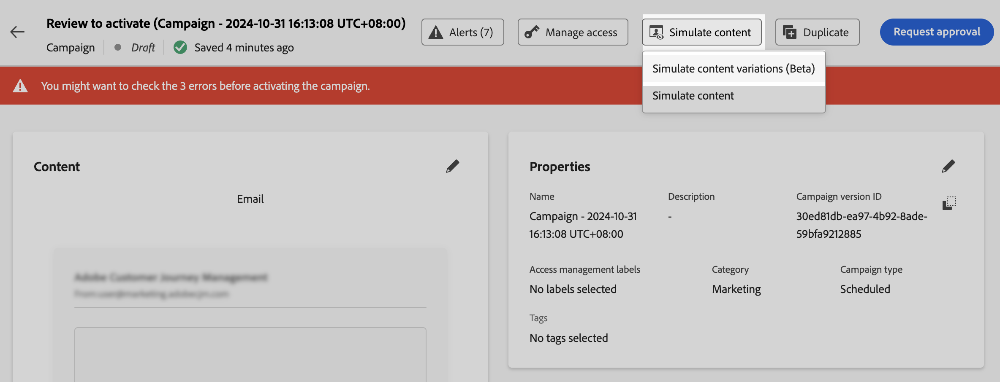
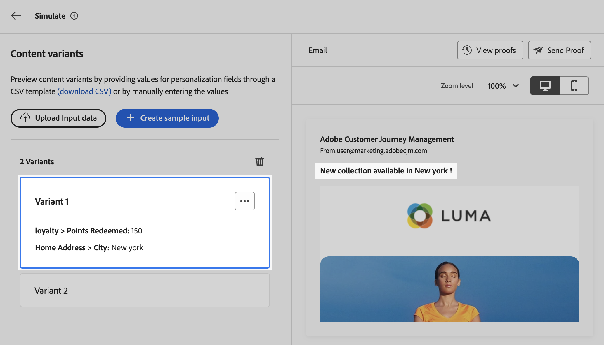

# Test your content using sample profiles {#custom-profiles}

>[!CONTEXTUALHELP]
>id="ajo_simulate_sample_profiles"
>title="Simulate using sample profiles"
>abstract="In this screen, you can preview email content and send proofs while impersonating sample profiles that you can upload from a CSV file or add manually directly from this screen."

<!--ATTENTE CONFIRMATION 

- nom (custom/sample)
- campaigns/journeys ou que campaigns

-->

>[!AVAILABILITY]
>
>This features is currently available as a beta to selected users only.

Journey optimizer allows you to preview and test email content using sample profiles that you can upload from a CSV file or add manually directly when simulating your content. This feature allows you to select sample profiles to use to preview your content and send proofs. All the profiles attributes used in your content for personalization are automatically detected by the system and can be used for your tests.

To access this experience, click the **[!UICONTROL Simulate content]** button and choose **[!UICONTROL Simulate with CSV(Beta)]**.

The main steps to test your content are as follows:

1. Add up to 30 sample profiles, either by uploading a CSV file, or by adding them one by one manually. [Learn how to add sample profiles](#profiles)
1. Check the preview of your content using the added profiles. [Learn how to preview your content](#preview)
1. Send up to 10 proofs to the email addresses while impersonating the desired sample profiles. [Learn how to send proofs](#proofs)

## Guardrails & limitations {#limitations}

Before starting testing your content using sample profiles, consider the following guardrails and prerequisites.

* As of now, testing using sample profiles is only available within campaigns, and for the email channel.
* The following features are not available in the current experience: Inbox rendering, spam reports, multilingual content and content experiment. To use these features, select the **[!UICONTROL Simulate content]** button from your content to access the previous user interface.
* Only profile attributes are currently supported. If contextual attributes are used in your content for personalization, you won't be able to test your content using these attributes.
* Only the following data types are supported when entering data for your sample profiles : number (integer and decimal), string, boolean and date type. Any other data type will show an error.

## Add sample profiles {#profiles}

You can add up to 30 sample profiles to test your content either using a CSV file, or manually:

* To upload profiles from a CSV file, click the **[!UICONTROL Download template]** link to retrieve a CSV file template. This templates includes a column for each profile attribute used in your content for personalization.

    Fill in the CSV file then click the **[!UICONTROL Upload sample profiles]** to load it to test your content.

* To add a profile manually, click the **[!UICONTROL Create sample profile]** button and fill in the information for the profile. One field displays for each profile attribute used in your content for personalization.

    

Once profiles have been selected, one box appears for each profile on the left side of the screen. You can use these profiles to preview your content and send proofs.

>[!NOTE]
>
>The added sample profiles only serve as testing purposes for your current content. The are not stored within Adobe Experience Platform, but into your user browser session, meaning that they won't display when logging off, or if working from another device.

## Preview your content using sample profiles {#preview}

To preview your content using one of the profiles, select the relevant box to update the content preview in the right section with the information entered for this profile.

You can remove a box at anytime using the ellipsis button in the upper-right corner and selecting **[!UICONTROL Remove]**. To edit information for a profile, click the ellipsis button and select **[!UICONTROL Edit]**.

## Send proofs {#proofs}

Journey Optimizer allows you to send proofs to email addresses while impersonating one or multiple sample profiles that you have added in the simulation screen. The steps are as follows:

1. Verify that sample profiles have been added to test your content and click the **[!UICONTROL Send Proof]** button.

1. In the **[!UICONTROL Recipients]** field, enter the email address to which you want to send the proof then click **[!UICONTROL Add]**. Repeat the operation to send the proof to additional email addresses. You can add up to 10 proof recipients.

1. In the bottom section of the screen, select the sample profiles that you want to impersonate in the proof. You can select multiple profiles, in which case the email will include as many proofs as selected profiles.

    For more information on a profile, select the **[!UICONTROL View profile details]** link. This allows you to display the information entered in the previous screen for the different profile attributes.

    

1. Click the **[!UICONTROL Send Proof]** button to start sending the proof.

You can track the sending at any time by clicking the **[!UICONTROL View proofs]** button in the simulate content screen.

