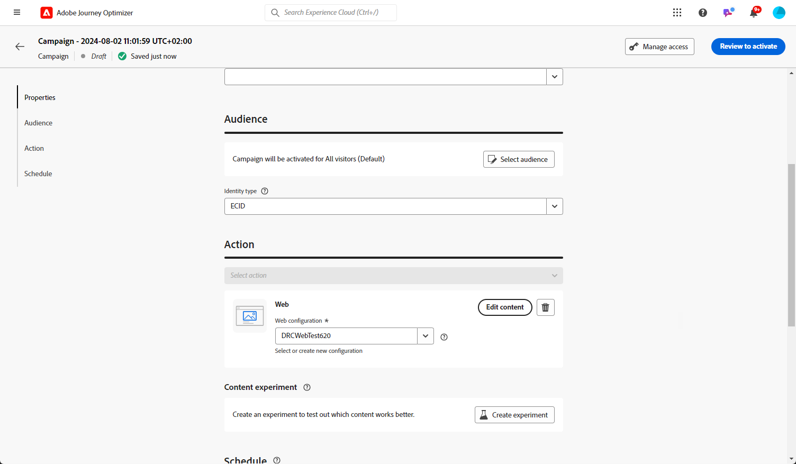
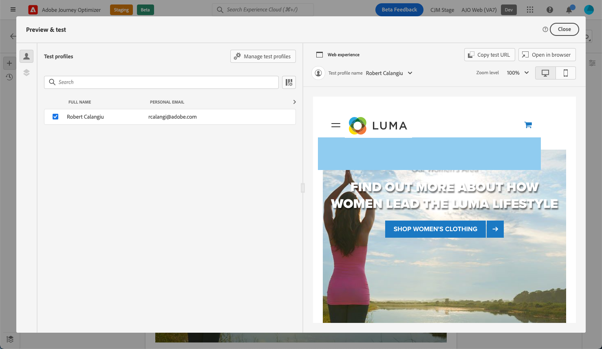
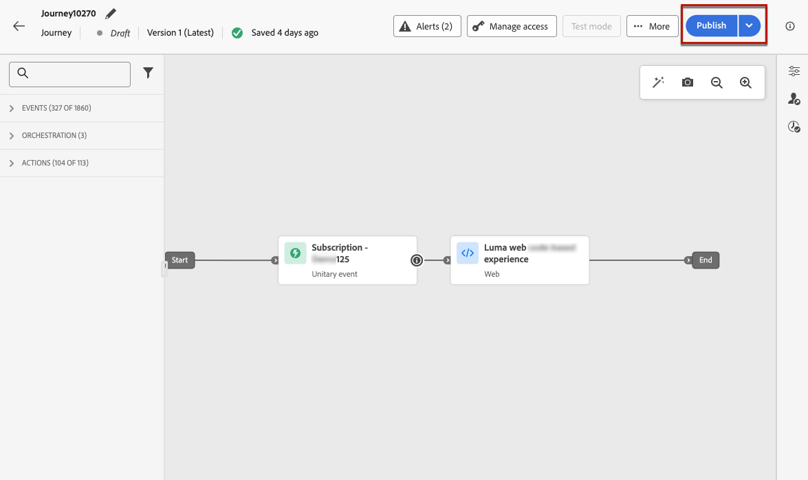

# Create web experiences {#create-web}

[!DNL Journey Optimizer] allows you to personalize the web experience you deliver to your customers through inbound journeys or campaigns.

## Add a web experience through a journey or a campaign {#create-web-experience}

>[!CONTEXTUALHELP]
>id="ajo_web_surface"
>title="Define a web configuration"
>abstract="A web configuration can match a single page URL or multiple pages, allowing you to deliver content modifications across one or several web pages."

>[!CONTEXTUALHELP]
>id="ajo_web_surface_rule"
>title="Build a pages matching rule"
>abstract="A pages matching rule enables to target multiple URLs matching the same rule - for example, if you want to apply the changes to a hero banner across a whole website or add a top image that displays on all the product pages of a website."

To start building your web experience through a campaign or a journey, follow the steps below.

>[!NOTE]
>
>If this is your first time creating a web experience, make sure you follow the prerequisites described in [this section](web-prerequisites.md).

>[!BEGINTABS]

>[!TAB Add a web experience to a journey]

To add a **Web** activity to a journey, follow these steps:

1. [Create a journey](../building-journeys/journey-gs.md).

1. Start your journey with an [Event](../building-journeys/general-events.md) or a [Read Audience](../building-journeys/read-audience.md) activity.

1. Drag and drop a **[!UICONTROL Web]** activity from the **[!UICONTROL Actions]** section of the palette.

   

    >[!NOTE]
    >
    >As **Web** is an inbound message activity, it comes with a 3-days **Wait** activity. [Learn more](../building-journeys/wait-activity.md#auto-wait-node)

1. Enter a **[!UICONTROL Label]** and **[!UICONTROL Description]** for your message.

1. Select or create the [Web configuration](web-configuration.md) to use.

    

1. Select the **[!UICONTROL Edit content]** button and edit your content as desired using the web designer. [Learn more](edit-web-content.md)

1. If necessary, complete your journey flow by dragging and dropping additional actions or events. [Learn more](../building-journeys/about-journey-activities.md)

1. Once your web experience is ready, finalize the configuration and publish your journey to activate it. [Learn more](../building-journeys/publishing-the-journey.md)

For more information on how to configure a journey, refer to [this page](../building-journeys/journey-gs.md).

>[!TAB Create a web campaign]

To start building your web experience through a campaign, follow the steps below.

1. Create a campaign. [Learn more](../campaigns/create-campaign.md)

1. Select the type of campaign that you want to execute

    * **Scheduled - Marketing**: execute the campaign immediately or on a specified date. Scheduled campaigns are aimed at sending marketing messages. They are configured and executed from the user interface.

    * **API-triggered - Marketing/Transactional**: execute the campaign using an API call. API-triggered campaigns are aimed at sending either marketing, or transactional messages, i.e. messages sent out following an action performed by an individual: password reset, cart purchase etc. [Learn how to trigger a campaign using APIs](../campaigns/api-triggered-campaigns.md)

1. Complete the steps to create a web campaign, such as the campaign properties, [audience](../audience/about-audiences.md), and [schedule](../campaigns/create-campaign.md#schedule).

1. Select the **[!UICONTROL Web]** action.

1. Select or create the web configuration. [Learn more on web configuration](web-configuration.md)

    

1. Click the **[!UICONTROL Edit content]** button to edit your content as desired using the web designer. [Learn more](edit-web-content.md)

    <!---->

For more information on how to configure a campaign, refer to [this page](../campaigns/get-started-with-campaigns.md).

➡️ [Learn how to create a web campaign in this video](#video)

>[!ENDTABS]

## Test the web experience {#test-web-experience}

>[!CONTEXTUALHELP]
>id="ajo_web_designer_preview"
>title="Preview your web experience"
>abstract="Get a simulation of what your web experience will look like."

Once you [authored your web experience](edit-web-content.md) using the web designer, you can use test profiles to preview your modified web pages. If you inserted personalized content, you can check how this content is displayed, using test profile data.

To do this, click **[!UICONTROL Simulate content]** from either the journey or campaign edit content screen, then add a test profile to check your web page using the test profile data.

You can also open it in the default browser, or copy the test URL to paste it in any browser. This allows you to share the link with your team and stakeholders who will be able to preview the new web experience in any browser before the campaign goes live.

>[!NOTE]
>
>When copying the test URL, the content displayed is the one personalized for the test profile used when the content simulation was generated in [!DNL Journey Optimizer].

Detailed information on how to select test profiles and preview your content is available in the [Content Management](../content-management/preview-test.md) section.

## Make your web experience live {#web-experience-live}

>[!IMPORTANT]
>
> If your campaign is subject to an approval policy, you will need to request approval in order to be able to activate your Web experiences. [Learn more](../test-approve/gs-approval.md)

Once you defined your web experience and you edited your content as desired using the [web designer](edit-web-content.md#work-with-web-designer), you can activate your journey or campaign to make your changes visible to your audience.

You can also preview your web experience content before making it live. [Learn more](#test-web-experience)

>[!NOTE]
>
>If you activate a web journey/campaign impacting the same pages as another journey or campaign which is already live, all the changes will be applied to your web pages.
>
>If multiple journeys or campaigns update the same element(s) of your website, the highest priority journey/campaign takes precedence.

### Publish a web journey {#activate-web-journey}

To make your web experience live from a journey, follow the steps below.

1. Verify that your journey is valid and that there is no error. [Learn more](../building-journeys/troubleshooting.md#checking-for-errors-before-testing)

1. From the journey, select the **[!UICONTROL Publish]** option, located in the top right drop-down menu.

    

    >[!NOTE]
    >
    >Learn more on publishing journeys in [this section](../building-journeys/publishing-the-journey.md).

Your web journey takes the **[!UICONTROL Live]** status and is now read-only. Each recipient of your journey can see the modifications you added to your website.

>[!NOTE]
>
>After you click **[!UICONTROL Publish]**, it can take up to 15 minutes for the changes to be available live on your website.

### Activate a web campaign {#activate-web-campaign}

Once you defined your web campaign settings and you edited your content as desired using the [web designer](edit-web-content.md#work-with-web-designer), you can review and activate your web campaign. Follow the steps below.

1. From your web campaign, select **[!UICONTROL Review to activate]**.

1. Check and edit if needed the content, properties, configuration, audience and schedule.

1. Select **[!UICONTROL Activate]**.

    

    >[!NOTE]
    >
    >Learn more on activating campaigns in [this section](../campaigns/review-activate-campaign.md).

Your web campaign takes the **[!UICONTROL Live]** status and is now visible to the selected audience. Each recipient of your campaign can see the modifications you added to your website.

>[!NOTE]
>
>After you click **[!UICONTROL Activate]**, it can take up to 15 minutes for web campaigns changes to be available live on your website.
>
>If you defined a schedule for your web campaign, it has the **[!UICONTROL Scheduled]** status until the start date and time are reached.

## Stop a web journey or campaign {#stop-web-experience}

When a web journey or campaign is live, you can stop it to prevent your audience from seeing your modifications. Follow the steps below.

1. Select a live journey or campaign from the respective list.

1. Perform the relevant action according to your case:

    * From the campaign top menu, select **[!UICONTROL Stop campaign]**.

        

    * From the journey top menu, click the **[!UICONTROL More]** button and select **[!UICONTROL Stop]**.

        

1. The modifications you added are not be visible anymore to the audience you defined.

>[!NOTE]
>
>Once a web journey or campaign is stopped, you cannot edit or activate it again. You can only duplicate it and activate the duplicated journey/campaign.

## How-to video{#video}

The video below shows how to create a web campaign, configure its properties, review, and publish it.

>[!VIDEO](https://video.tv.adobe.com/v/3418800/?quality=12&learn=on)