# Create web experiences {#create-web}

[!DNL Journey Optimizer] allows you to personalize the web experience you deliver to your customers through inbound journeys or campaigns.

## Define a web experience through a journey or a campaign {#create-web-experience}

>[!CONTEXTUALHELP]
>id="ajo_web_surface"
>title="Define a web configuration"
>abstract="A web configuration can match a single page URL or multiple pages, allowing you to deliver content modifications across one or several web pages."

>[!CONTEXTUALHELP]
>id="ajo_web_surface_rule"
>title="Build a pages matching rule"
>abstract="A pages matching rule enables to target multiple URLs matching the same rule - for example, if you want to apply the changes to a hero banner across a whole website or add a top image that displays on all the product pages of a website."

To start building your web experience through a campaign or a journey, follow the steps below.

>[!NOTE]
>
>If this is your first time creating a web experience, make sure you follow the prerequisites described in [this section](web-prerequisites.md).

>[!BEGINTABS]

>[!TAB Add a web experience to a journey]

To add a **Web** activity to a journey, follow these steps:

1. [Create a journey](../building-journeys/journey-gs.md).

1. Start your journey with an [Event](../building-journeys/general-events.md) or a [Read Audience](../building-journeys/read-audience.md) activity.

1. Drag and drop an **[!UICONTROL Action]** activity from the **[!UICONTROL Actions]** section of the palette. Learn more about the [Action activity](../building-journeys/journey-action.md).

    >[!IMPORTANT]
    >
    >Legacy native channel activities (Email, Push, SMS, In-app, Web, Code-based experience, and Content Card) are deprecated as of the March 2026 release. Existing journeys using these activities continue to work without any changes—no migration is required.

1. Select **[!UICONTROL Web]** as the action type.

   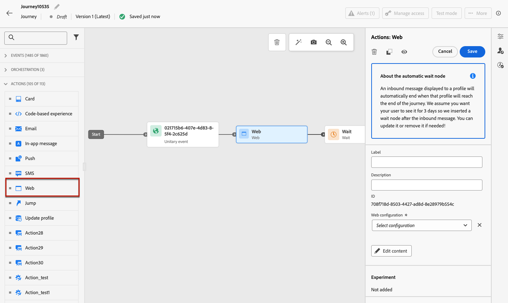

    >[!NOTE]
    >
    >As **Web** is an inbound experience activity, it comes with a 3-days **Wait** activity. [Learn more](../building-journeys/wait-activity.md#auto-wait-node)

1. Enter a **[!UICONTROL Label]** to identify your action in the journey canvas.

1. Click the **[!UICONTROL Configure action]** button.

1. You are directed to the **[!UICONTROL Actions]** tab. From there, select or create the [Web configuration](web-configuration.md) to use.

    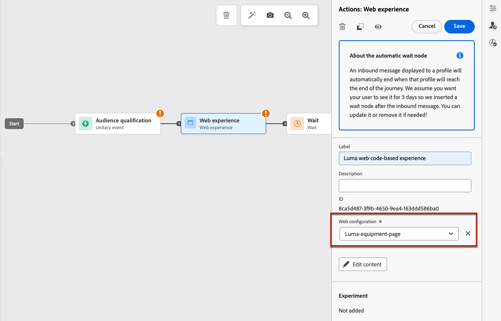

1. You can add one or more inbound actions to your web experience by clicking the **[!UICONTROL Add action]** button. [Learn more](../building-journeys/journey-action.md#multi-action)

1. Go back to the journey canvas. If necessary, complete your journey flow by dragging and dropping additional actions or events. [Learn more](../building-journeys/about-journey-activities.md)

1. Select the **[!UICONTROL Edit content]** button and edit your content as desired. [Learn more](#edit-web-content)

For more information on how to create, configure and publish a journey, refer to [this page](../building-journeys/journey-gs.md).

>[!TAB Create a web campaign]

To start building your web experience through a campaign, follow the steps below.

1. Create a campaign. [Learn more](../campaigns/create-campaign.md)

1. Select the type of campaign that you want to execute

    * **Scheduled - Marketing**: execute the campaign immediately or on a specified date. Scheduled campaigns are aimed at sending marketing messages. They are configured and executed from the user interface.

    * **API-triggered - Marketing/Transactional**: execute the campaign using an API call. API-triggered campaigns are aimed at sending either marketing, or transactional messages, i.e. messages sent out following an action performed by an individual: password reset, cart purchase etc. [Learn how to trigger a campaign using APIs](../campaigns/api-triggered-campaigns.md)

1. Complete the steps to create a web campaign, such as the campaign properties, [audience](../audience/about-audiences.md), and [schedule](../campaigns/create-campaign.md#schedule).

1. Select the **[!UICONTROL Web]** action.

1. Select or create the web configuration. [Learn more about web configuration](web-configuration.md)

    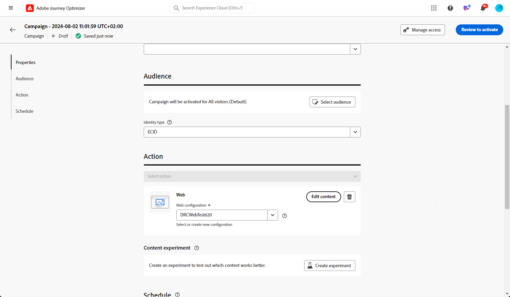

1. Click the **[!UICONTROL Edit content]** button to edit your content as desired. [Learn more](#edit-web-content)

    <!--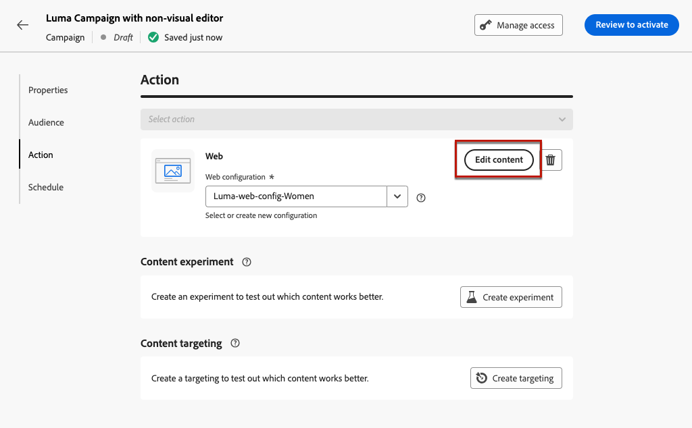-->

For more information on how to configure a campaign, refer to [this page](../campaigns/get-started-with-campaigns.md).

➡️ [Learn how to create a web campaign in this video](#video)

>[!ENDTABS]

## Edit web content {#edit-web-content}

>[!CONTEXTUALHELP]
>id="ajo_web_url_to_edit_surface"
>title="Confirm the URL to edit"
>abstract="Confirm the URL of the specific web page to use for editing the content that will be applied on the web configuration defined above. The web page must be implemented using the Adobe Experience Platform Web SDK."
>additional-url="https://experienceleague.adobe.com/docs/platform-learn/implement-web-sdk/overview.html" text="Learn more"

>[!CONTEXTUALHELP]
>id="ajo_web_url_to_edit_rule"
>title="Enter the URL to edit"
>abstract="Enter the URL of a specific web page to use for editing the content that will be applied to all pages matching the rule. The web page must be implemented using Adobe Experience Platform Web SDK."
>additional-url="https://experienceleague.adobe.com/docs/platform-learn/implement-web-sdk/overview.html" text="Learn more"

Once you [added a web action](#create-web-experience) to a journey or a campaign, you can edit the content of your site using either:

* the [web designer](web-visual-editor.md), to author your experience using a visual editor;
* or the [non-visual editor](web-non-visual-editor.md).

To start authoring your web experience, follow the steps below.

1. From the **[!UICONTROL Action]** tab of the campaign or the **[!UICONTROL Web]** activity in the journey, select **[!UICONTROL Edit content]**.

    

1. The edition screen displays. You can either:

    * Click the **[!UICONTROL Edit web page]** button to start authoring your content using the web designer for a visual experience. [Learn more](web-visual-editor.md)

        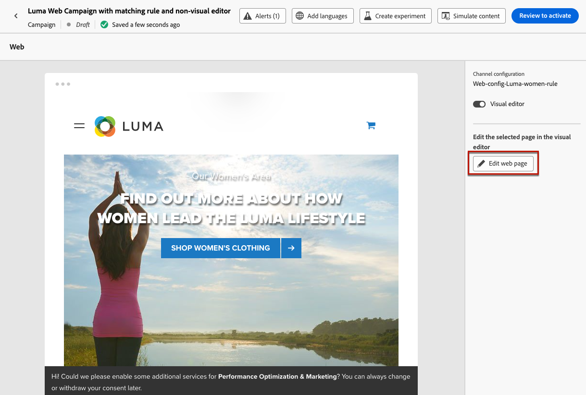

    * Unselect the **[!UICONTROL Visual editor]** option to use the non-visual edition mode instead, and click **[!UICONTROL Add a modification]** to start editing your web content without loading the visual editor. [Learn more](web-non-visual-editor.md)

        

## Test the web experience {#test-web-experience}

>[!CONTEXTUALHELP]
>id="ajo_web_designer_preview"
>title="Preview your web experience"
>abstract="Get a simulation of what your web experience will look like."

Once you [authored your web experience](web-visual-editor.md) using the web designer, you can preview your modified web pages using either simulation method:

* Click **[!UICONTROL Simulate content]** to test content variations with sample input data or AI auto-generation. [Learn how to simulate content variations](../test-approve/simulate-sample-input.md)
* Click **[!UICONTROL Simulate content]**, then select **[!UICONTROL Simulate content (AEP profiles)]** from the dropdown to preview with test profiles and add a test profile to check your web page.

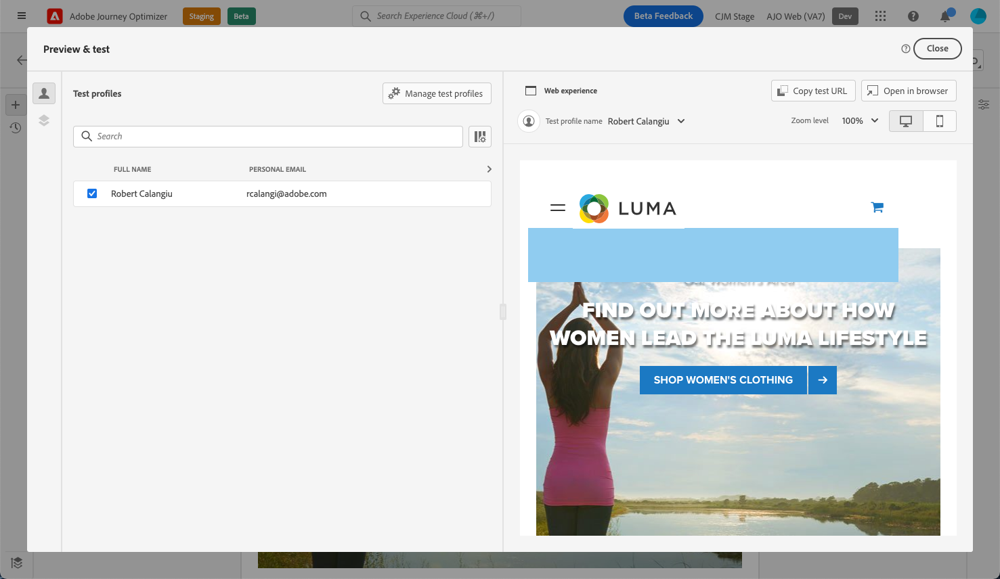

You can also open it in the default browser, or copy the test URL to paste it in any browser. This allows you to share the link with your team and stakeholders who will be able to preview the new web experience in any browser before the campaign goes live.

>[!NOTE]
>
>When copying the test URL, the content displayed is the one personalized for the test profile used when the content simulation was generated in [!DNL Journey Optimizer].

Detailed information on how to select test profiles and preview your content is available in the [Content Management](../content-management/preview-test.md) section.

## Redirect to URL {#web-redirect-to-url}

>[!CONTEXTUALHELP]
>id="ajo_web_designer_redirect"
>title="Redirect to another URL"
>abstract="Enter an existing URL where you want to redirect the visitors of your page."

When creating a web experience, you can redirect visitors to another existing URL rather than authoring a new variation in the web designer.

Using this capacity, you can run a [Content experiment](../content-management/content-experiment.md) comparing two different experiences instead of just changing a few elements within a page.

For example, create a web campaign with two treatments:

* In **Treatment A**, author a web experience using the web designer for half of your targeted population.

* In **Treatment B**, select the **[!UICONTROL Redirect to URL]** option for the other half of the targeted population. Enter the URL of a page with an alternate design that you authored outside of [!DNL Journey Optimizer].

    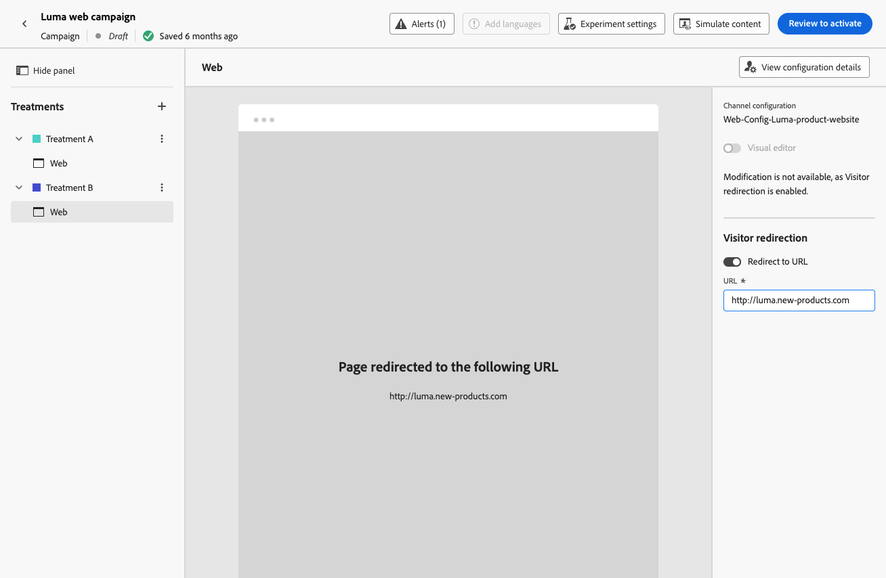

    >[!NOTE]
    >
    >The website preview does not display anymore and the **[!UICONTROL Visual editor]** toggle button is disabled.

Once your web campaign is live, you can track how the web experience you authored in [!DNL Journey Optimizer] is performing for the visitors of your page against those who were redirected to the external landing page. Learn how with the [experimentation campaign report](../reports/campaign-global-report-cja-experimentation.md)

## Make your web experience live {#web-experience-live}

>[!IMPORTANT]
>
> If your campaign is subject to an approval policy, you will need to request approval in order to be able to activate your Web experiences. [Learn more](../test-approve/gs-approval.md)

Once you defined your web experience and you edited your content as desired, you can activate your journey or campaign to make your changes visible to your audience.

You can also preview your web experience content before making it live. [Learn more](#test-web-experience)

>[!NOTE]
>
>If you activate a web journey/campaign impacting the same pages as another journey or campaign which is already live, all the changes will be applied to your web pages.
>
>If multiple journeys or campaigns update the same element(s) of your website, the highest priority journey/campaign takes precedence.

### Publish a web journey {#activate-web-journey}

To make your web experience live from a journey, follow the steps below.

1. Verify that your journey is valid and that there is no error. [Learn more](../building-journeys/troubleshooting.md#activity-errors)

1. From the journey, select the **[!UICONTROL Publish]** option, located in the top right drop-down menu.

    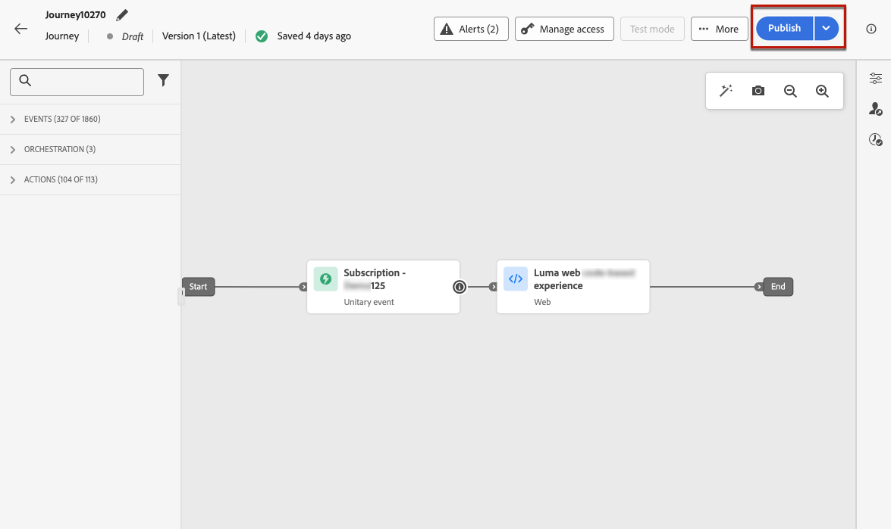

    >[!NOTE]
    >
    >Learn more about publishing journeys in [this section](../building-journeys/publish-journey.md).

Your web journey takes the **[!UICONTROL Live]** status and is now read-only. Each recipient of your journey can see the modifications you added to your website.

>[!NOTE]
>
>After you click **[!UICONTROL Publish]**, it can take up to 15 minutes for the changes to be available live on your website.

### Activate a web campaign {#activate-web-campaign}

Once you defined your web campaign settings and you edited your content as desired, you can review and activate your web campaign. Follow the steps below.

1. From your web campaign, select **[!UICONTROL Review to activate]**.

1. Check and edit if needed the content, properties, configuration, audience and schedule.

1. Select **[!UICONTROL Activate]**.

    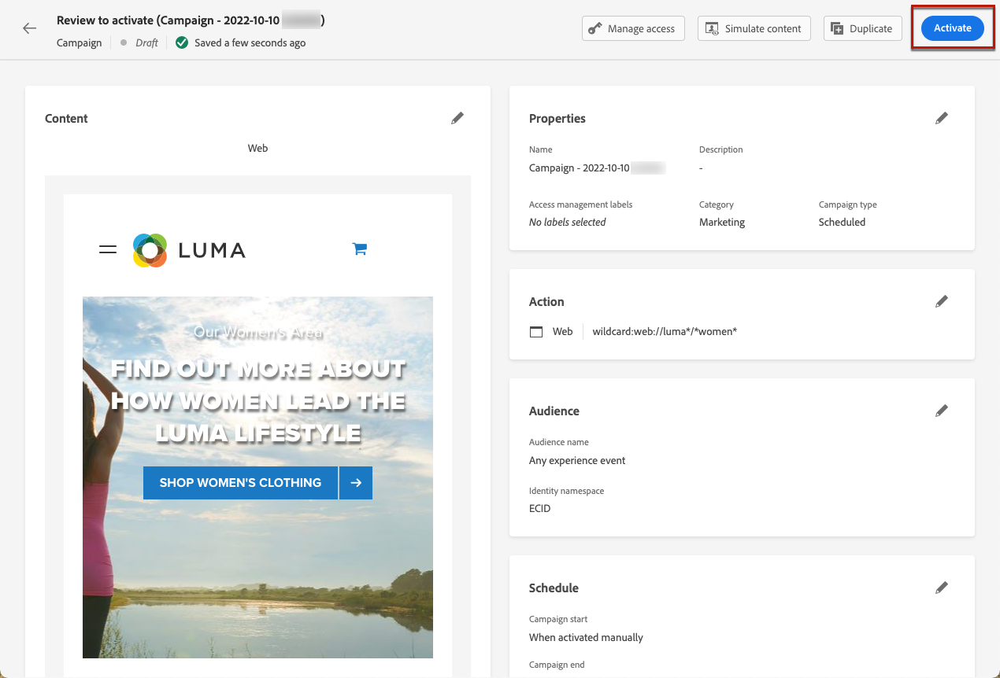

    >[!NOTE]
    >
    >Learn more about activating campaigns in [this section](../campaigns/review-activate-campaign.md).

Your web campaign takes the **[!UICONTROL Live]** [status](../campaigns/manage-campaigns.md#statuses) and is now visible to the selected audience. Each recipient of your campaign can see the modifications you added to your website.

>[!NOTE]
>
>After you click **[!UICONTROL Activate]**, it can take up to 15 minutes for web campaigns changes to be available live on your website.
>
>If you defined a schedule for your web campaign, it has the **[!UICONTROL Scheduled]** [status](../campaigns/manage-campaigns.md#statuses) until the start date and time are reached.

Once your experience is live, you can monitor your web journeys and campaigns. [Learn more](monitor-web-experiences.md)

## Stop a web journey or campaign {#stop-web-experience}

When a web journey or campaign is live, you can stop it to prevent your audience from seeing your modifications. Follow the steps below.

1. Select a live journey or campaign from the respective list.

1. Perform the relevant action according to your case:

    * From the campaign top menu, select **[!UICONTROL Stop campaign]**.

        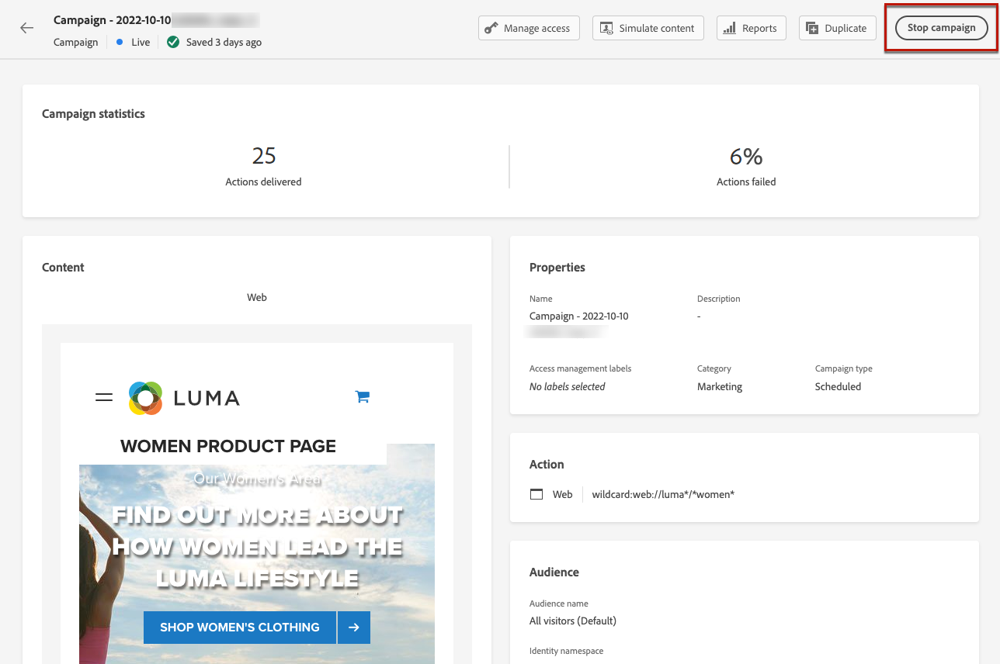

    * From the journey top menu, click the **[!UICONTROL More]** button and select **[!UICONTROL Stop]**.

        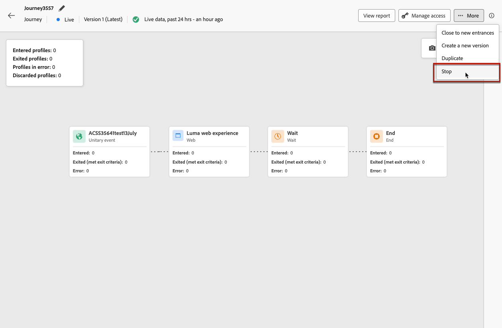

1. The modifications you added are not be visible anymore to the audience you defined.

>[!NOTE]
>
>Once a web journey or campaign is stopped, you cannot edit or activate it again. You can only duplicate it and activate the duplicated journey/campaign.

## How-to video{#video}

The video below shows how to create a web campaign, configure its properties, review, and publish it.

>[!VIDEO](https://video.tv.adobe.com/v/3418800/?quality=12&learn=on)