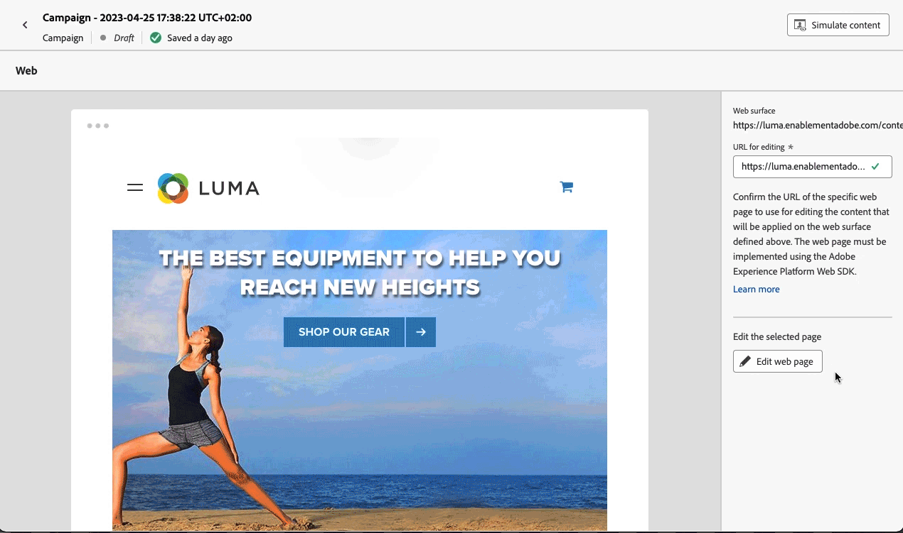

# Get started with web channel {#get-started-web}

[!DNL Journey Optimizer] allows you to visually author and deliver personalized web experiences to your customers.

Through an intuitive visual interface, use the web channel to modify your web properties easily to experiment, optimize and personalize your end-user campaigns.

 
If you are already using outbound channels for message delivery, such as email, SMS or push notifications, you can leverage the inbound web channel to offer a truly personalized experience that spans across all channels.

Once you created a journey or campaign, select **Web** as your action and define basic settings. For more information on how to configure your journey/campaign, refer to this [page](create-web.md#create-web-experience).

>[!NOTE]
>
>If this is your first time creating a web experience, make sure you follow the prerequisites described in [this section](web-prerequisites.md).

Discover the detailed steps to create a web campaign in [this video](create-web.md#video).

<table style="table-layout:fixed"><tr style="border: 0;">
<td>

<a href="web-prerequisites.md"><strong>Prerequisites</strong>

</td>
<td>

<a href="create-web.md"><strong>Create a web experience</strong></a>

</td>
<td>

<a href="web-visual-editor.md"><strong>Author web pages</strong></a>

</td>
<td>

<a href="monitor-web-experiences.md"><strong>Reporting</strong></a>

</td>
</tr></table>

## Additional resources

* **[Create web experiences](create-web.md)** - Learn how to create and configure web campaigns and journeys to modify web content.
* **[Web channel prerequisites](web-prerequisites.md)** - Understand the technical requirements and setup needed for web channel implementation.
* **[Edit web content](create-web.md#edit-web-content)** - Master the web designer to modify pages using visual or non-visual editing modes.
* **[Manage web modifications](manage-web-modifications.md)** - Learn how to organize, apply, and manage modifications across your web experiences.
* **[Monitor web experiences](monitor-web-experiences.md)** - Track and analyze the performance of your web campaigns with detailed reporting.
* **[Web campaign tutorials](https://experienceleague.adobe.com/en/docs/journey-optimizer-learn/tutorials/channels/web-channel/create-a-web-campaign){target="_blank"}** - Explore step-by-step video tutorials on web channel features and best practices.

