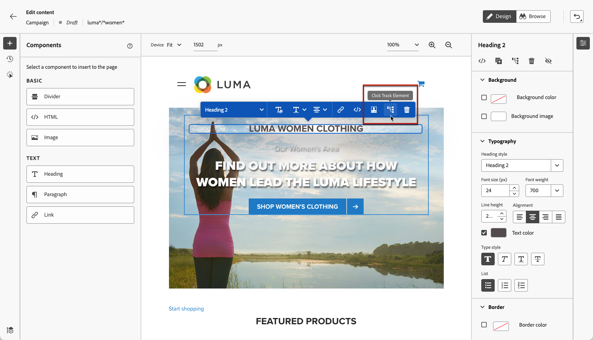
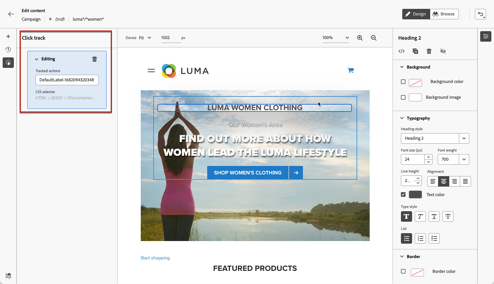
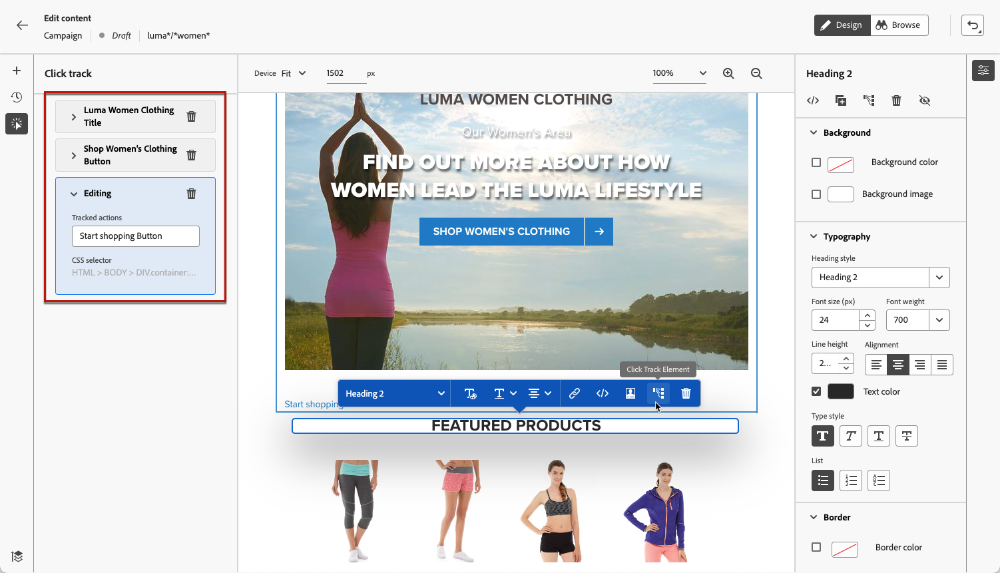

# Monitor your web experiences {#monitor-web-experiences}

## Check the web reports {#check-web-reports}

Once your web experience is live, you can check the **[!UICONTROL Web]** tab of the  [Journey report](../reports/journey-global-report-cja-web.md) and [Campaign report](../reports/campaign-global-report-cja-web.md) to compare elements such as the number of impressions, click rate and number of engagements with your web page.

<!--You can check the **[!UICONTROL Web]** tab of the campaign reports. Learn more about the campaign web [live report](../reports/campaign-live-report.md#web-tab) and [global report](../reports/campaign-global-report-cja.md#web).-->

To further improve your web experience monitoring, you can also track the clicks on any specific element of your website. This allows you to display the number of clicks on that element in the web reports. [Learn how](#use-click-tracing)

## Use click tracking {#use-click-tracking}

The web designer allows you to select any element of your website and track the clicks on that element.

This information can be useful to improve your website users' experience. For example, if the [web reports](../reports/campaign-global-report-cja-web.md) show that many users click an element that is not actually clickable, you may want to add a link to that element.

1. Select an element in your page and choose **[!UICONTROL Click track element]** from the contextual menu.

    
    
    >[!NOTE]
    >
    >Any item, clickable or not, can be selected.

1. The corresponding tracked action automatically displays in the **[!UICONTROL Click track]** pane on the left. 

    

1. Add a meaningful label to manage all your tracked elements and find them easily in the reports. The **[!UICONTROL CSS selector]** field shows information to locate the selected element.

1. Repeat the steps above to select as many other elements as you need for click tracking. The corresponding actions are all listed on the left pane.

    

1. To remove click tracking on an element, select the corresponding delete icon.

Once your campaign is live, you can check the number of clicks for each element in the campaign web [live report](../reports/campaign-live-report.md#web-tab) and [Customer Journey Analytics report](../reports/campaign-global-report-cja-web.md).
