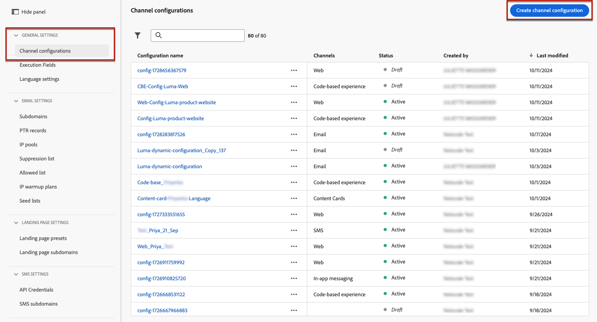

# Create web channel configuration {#web-configuration}

>[!CONTEXTUALHELP]
>id="ajo_admin_page_rule"
>title="Pages matching rule"
>abstract="To efficiently manage and target a group of URLs that share the same criteria, create a Pages matching rule. This rule enables you to consolidate multiple URLs under one guideline, simplifying the application of consistent settings and actions across these pages."

>[!CONTEXTUALHELP]
>id="ajo_admin_default_url"
>title="Default authoring and preview URL"
>abstract="This field ensures that the pages generated or matched by the rule have a designated URL, essential for both creating and previewing content effectively."

A web configuration is a web property identified by a URL where the content will be delivered. It can match a single page URL or multiple pages, allowing you to deliver modifications across one or several web pages.

1. Access the **[!UICONTROL Channels]** > **[!UICONTROL General settings]** > **[!UICONTROL Channel configurations]** menu, then click **[!UICONTROL Create channel configuration]**.

    

1. Enter a name and a description (optional) for the configuration.

    >[!NOTE]
    >
    > Names must begin with a letter (A-Z). It can only contain alpha-numeric characters. You can also use underscore `_`, dot`.` and hyphen `-` characters.

1. To assign custom or core data usage labels to the configuration, you can select **[!UICONTROL Manage access]**. [Learn more on Object Level Access Control (OLAC)](../administration/object-based-access.md).

1. Select **Web** channel.

    

1. Select **[!UICONTROL Marketing action]**(s) to associate consent policies to the messages using this configuration. All consent policies associated with the marketing action are leveraged in order to respect the preferences of your customers. [Learn more](../action/consent.md#surface-marketing-actions)

1. You can either enter a **[!UICONTROL Page URL]** if you want to apply the changes to a single page only.
    
1. Or you can build a **[!UICONTROL Pages matching rule]** to target multiple URLs matching the same rule - for example, if you want to apply the changes to a hero banner across a whole website or add a top image that displays on all the product pages of a website.

    To do so, select **[!UICONTROL Pages matching rule]**.

1. Define your criteria for the **[!UICONTROL Domain]** and **[!UICONTROL Page]** fields.

    For example, if you want to edit elements that are displayed on all the women product pages of your Luma website, select **[!UICONTROL Domain]** > **[!UICONTROL Starts with]** > `luma` and **[!UICONTROL Page]** > **[!UICONTROL Contains]** > `women`.

    

1. If you created a **[!UICONTROL Page matching rule]**, you need to enter the **Default** authoring and preview URL. This step ensures that the pages generated or matched by the rule have a designated URL for both content creation and preview purposes. Learn more about page matching rule in the [section below](#web-page-matching-rule).

1. Save your changes.

You can now select your configuration when using Web channel in campaigns or journeys.

## Page matching rule {#web-page-matching-rule}

When creating a rule that matches multiple pages so that you can apply the same content changes across multiple pages at once, you can use different operators on the **Domain** and on the **Path** sections to build your desired rule. Please check the available operators below.

Available operators for building page matching rules:

* **Domain**

    | Operator  | Description  | Examples   | 
    |---|---|---|
    | Equals  | Exact match of the domain.  | 
    | Starts with  | Matches all the domains (including sub-domains) which start with the string entered.  | Ex: "Starts with: dev" -> matches all the domains and subdomains that start with "dev", like: dev.example.com, dev.products.example.com, developer.example.com   | 
    | Ends with  | Matches all the domains (including sub-domains) which end with the string entered.  | Ex: "Ends with: example.com" -> matches all the domains and subdomains that ends with "example.com", like: stage.example.com, prod.example.com, myexample.com   |  
    | Wildcard matching  | "Wildcard matching" operator allows the user to define a wildcard match in the middle of the the string, like "dev.*.example.com". The validation rules are that the value must contain one and only one wildcard (asterisk) when the operator is "wildcard matching".  | Ex: "Wildcard matching: dev.*.example.com" -> matches domains like: dev.products.example.com, dev.mytest.products.example.com, dev.blog.example.com   | 
    | Any  | Matches all the domains – useful when testing a particular path across domains  |

* **Path**

    | | | |
    |-|-|-|
    |Operator |Description |Examples |
    |Equals |Exact match of the path. |  |
    |Starts with |Matches all the paths (including sub-paths) which start with the string entered. |  |
    |Ends with |Matches all the paths (including sub-paths) which end with the string entered. |  |
    |Any |Matches all the paths – useful when targeting all paths under one or multiple domains. |  |
    |Wildcard matching |"Wildcard matching" operator allows the user to define an internal wildcard inside the path, like "/products/*/detail".  The wildcard character * in Path ** component, matches any sequence of characters until the first / character is encountered.  /*/ matches any sequence of characters (including sub-paths) |Ex: "Wildcard matching: /products/*/detail", matches all the paths like:  example.com/products/yoga/detail  example.com/products/surf/detail  example.com/products/tennis/detail  example.com/products/yoga/pants/detail   Ex: "Matches: /prod*/detail, matches all the paths like:  example.com/products/detail  example.com/production/detail   does not match paths like:  example.com/products/yoga/detail |
    |Contains |"contains" gets translated to a wildcard like "mystring" and matches all the paths that contain this sequence of characters. |Ex: "Contains: product", matches all the paths that contain the string product, like: example.com/products, example.com/yoga/perfproduct, example.com/surf/productdescription, example.com/home/product/page |

If your use case cannot be modeled using one rule then you have the option to add multiple page rules and you can use 'Or' or 'Exclude' operators between them. 'Exclude' is useful when one of the pages that match the rule defined shouldn't be targeted: for example all "example.com" pages that contain "product", excluding the following page: `https://example.com/blogs/productinfo`.
