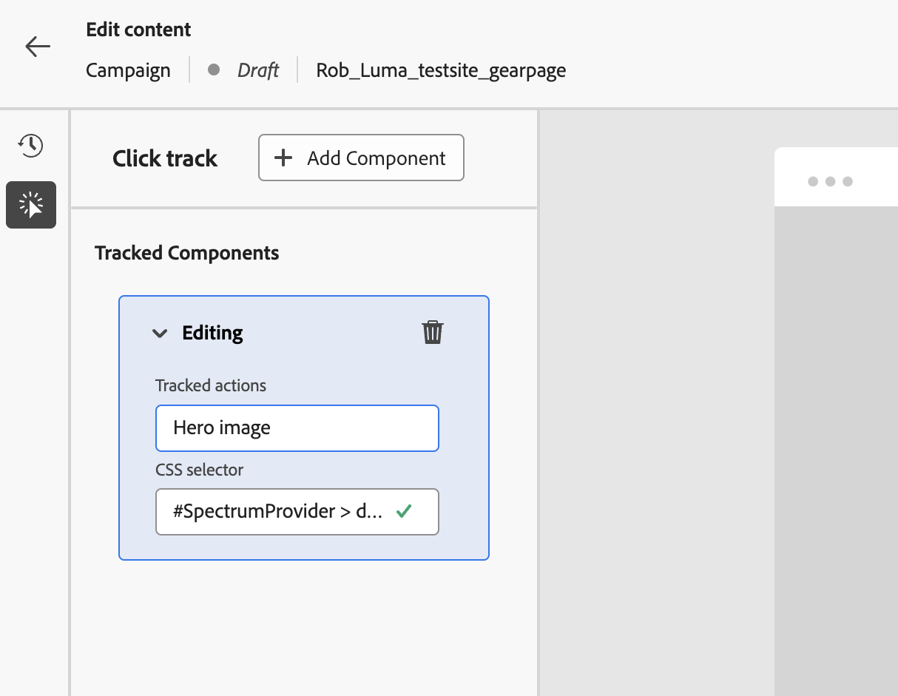

# Use the web non-visual editor {#web-non-visual-editor}

In addition to the [!DNL Journey Optimizer] visual [web designer](web-visual-editor.md), you can also add modifications to your web pages using a **non-visual editor**.

This can be useful if you cannot, or are not allowed to, install browser extensions such as the [Adobe Experience Cloud Visual Helper](web-prerequisites.md#visual-authoring-prerequisites), which is required to load your pages in the web designer.

In certain cases, you may also find it easier to use a non-visual editor to apply modifications on a particular CSS selector, without the risk to modify other elements on a web page or to change the page structure.
 
To author your web experiences with the non-visual editor, follow the steps below.

1. From the **[!UICONTROL Edit content]** screen in the journey or campaign, unselect the **[!UICONTROL Visual editor]** option.

1. Click **[!UICONTROL Add a modification]** to start editing your web content.

    

1. The non-visual editor displays. You can add your first modification using the left pane.

    

1. Select the modification type:

    * **[!UICONTROL CSS Selector]** - [Learn more](manage-web-modifications.md#css-selector)
    * **[!UICONTROL Page `<Head>`]** - [Learn more](manage-web-modifications.md#page-head)

1. Click the **[!UICONTROL Advanced editing options]** button. The personalization editor opens.

    You can leverage the [!DNL Journey Optimizer] personalization editor with all its personalization and authoring capabilities. [Learn more](../personalization/personalization-build-expressions.md)

1. Enter your content and **[!UICONTROL Save]** your changes.

    

1. Your first modification displays on top of the **[!UICONTROL Modifications]** pane.

    Click the **[!UICONTROL More actions]** button next to your modification and select **[!UICONTROL Info]** to display its details. You can also **[!UICONTROL Edit]** or **[!UICONTROL Delete]** the modification.

    

    >[!NOTE]
    >
    >The **[!UICONTROL Modifications]** pane is the same as when using the [web designer](web-visual-editor.md). All the actions you can perform with it are detailed in [this section](manage-web-modifications.md#use-modifications-pane).

1. Click the **[!UICONTROL More actions]** button on top of the **[!UICONTROL Modifications]** pane to **[!UICONTROL Add a modification]**, and repeat the steps above. [Learn more](manage-web-modifications.md#add-modifications)

    

1. Select the arrow on top left of the screen to come back to the journey or campaign edition screen. You can see the current number of changes and add more modifications.

    

    You can also switch to the web designer if desired. All your modifications will be preserved.

1. You can select any element of your website and track the clicks on that element. To enable click tracking, and define the actions to track, click the second icon on the left rail, as shown below:
    
    

    Use the **Add Component** button to select a new action to track. Learn more about click tracking usage in [this section](monitor-web-experiences.md#use-click-tracking).
