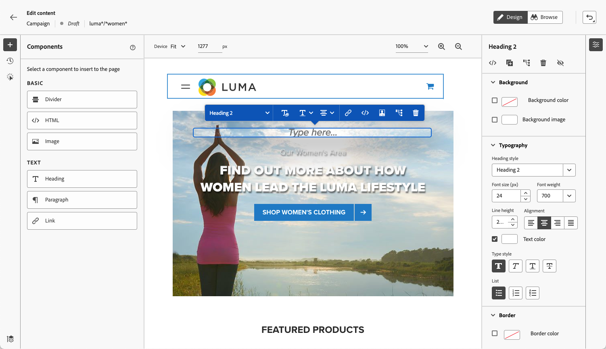

# Work with the web designer {#work-with-web-designer}
<!--
>[!CONTEXTUALHELP]
>id="ajo_web_url_to_edit_surface"
>title="Confirm the URL to edit"
>abstract="Confirm the URL of the specific web page to use for editing the content that will be applied on the web configuration defined above. The web page must be implemented using the Adobe Experience Platform Web SDK."
>additional-url="https://experienceleague.adobe.com/docs/platform-learn/implement-web-sdk/overview.html" text="Learn more"

>[!CONTEXTUALHELP]
>id="ajo_web_url_to_edit_rule"
>title="Enter the URL to edit"
>abstract="Enter the URL of a specific web page to use for editing the content that will be applied to all pages matching the rule. The web page must be implemented using Adobe Experience Platform Web SDK."
>additional-url="https://experienceleague.adobe.com/docs/platform-learn/implement-web-sdk/overview.html" text="Learn more"
-->

In [!DNL Journey Optimizer], visual web authoring is powered by the **Adobe Experience Cloud Visual Helper** Chrome browser extension. [Learn more](web-prerequisites.md#visual-authoring-prerequisites)

>[!CAUTION]
>
>To be able to access and author web pages in the [!DNL Journey Optimizer] user interface, make sure you follow the prerequisites listed in [this section](web-prerequisites.md).

## Start authoring your web experience 

To start authoring your web experience using the visual web designer, follow the steps below.

>[!CAUTION]
>
>The [Adobe Experience Platform Web SDK](https://experienceleague.adobe.com/docs/platform-learn/implement-web-sdk/overview.html){target="_blank"} must be included into your web page. [Learn more](web-prerequisites.md#implementation-prerequisites)
    
1. From the **[!UICONTROL Edit content]** screen, click **[!UICONTROL Edit web page]** to open the web designer.

    

    <!---->

    >[!NOTE]
    >
    >If you attempt to load a website that fails to load, a message displays suggesting that you install the [Visual Editing Helper browser extension](#install-visual-editing-helper). See some tips for troubleshooting in [this section](web-prerequisites.md#troubleshooting).
    >
    >You can also edit your web content without loading the visual editor. To do so, unselect the **[!UICONTROL Visual editor]** option to use the non-visual edition mode instead. [Learn more](web-non-visual-editor.md)

1. Once in the web designer, select any element from the canvas, such as image, button, paragraph, text, container, heading, link etc. [Learn more](#content-components)

1. To edit an element, you can use:

    * The contextual menu to edit its content, layout, insert links or personalization, etc.

        

    * The icons on top of the right panel to edit, duplicate, delete or hide each element.

        

    * The right panel that changes dynamically according to the selected element. For example, you can edit the background, typography, border, size, position, spacing, effects or inline styles of an element.

        

>[!NOTE]
>
>The web content designer is mostly similar to the email designer. Learn more on [designing content with [!DNL Journey Optimizer]](../email/get-started-email-design.md).

Once you edited your web content, you can manage your modifications. [Learn more](manage-web-modifications.md)

## Use components {#content-components}

>[!CONTEXTUALHELP]
>id="ajo_web_designer_components"
>title="Add components to your web page"
>abstract="You can add a number of components to your web page and edit them as you need."

1. From the **[!UICONTROL Components]** pane on the left, select an item. You can add the following components to your web page and edit them as you need:

    * [Divider](../email/content-components.md#divider)
    * [HTML](../email/content-components.md#HTML)
    * [Image](../email/content-components.md#image)
    * Heading - Using this component is similar to using the **[!UICONTROL Text]** component in the email designer. [Learn more](../email/content-components.md#text)
    * Paragraph - Using this component is similar to using the **[!UICONTROL Text]** component in the email designer. [Learn more](../email/content-components.md#text)
    * Link

    

1. Hover in the page and click the **[!UICONTROL Insert before]** or **[!UICONTROL Insert after]** button to append the component to an existing element on the page.

    

    >[!NOTE]
    >
    >To unselect a component, click the **[!UICONTROL ESC]** button in the contextual blue banner displayed on top of the canvas.

1. Edit the component as needed directly in the content of your page.

    

1. Adjust the styles that display from the contextual pane on the right, such as background, text color, border, size, position, etc. - depending on the selected component.

    

## Add personalization 

To add personalization, select a container and select the personalization icon from the contextual menu bar that displays. Add your changes using the personalization editor. [Learn more](../personalization/personalization-build-expressions.md)

## Navigate through the web designer {#navigate-web-designer}

This section details the different ways you can navigate through the web designer. To view and manage the modifications added to your web experience, see [this section](manage-web-modifications.md).

### Use breadcrumbs {#breadcrumbs}

1. Select any element from the canvas.

1. Click the **[!UICONTROL Expand/Collapse Breadcrumbs]** button on the lower left side of the screen to quickly display information about the selected element.

    

1. When you hover over the breadcrumbs, the corresponding element is highlighted in the editor.

1. Using it you can easily navigate to any parent, sibling, or child element within the visual editor.

### Swap to browse mode {#browse-mode}

>[!CONTEXTUALHELP]
>id="ajo_web_designer_browse"
>title="Use the browse mode"
>abstract="From this mode, you can navigate to the exact page from the selected configuration you want to personalize."

You can swap from the default **[!UICONTROL Design]** mode to the **[!UICONTROL Browse]** mode using the dedicated button.

From the **[!UICONTROL Browse]** mode, you can navigate to the exact page from the selected configuration you want to personalize.

It is especially useful when dealing with pages that are behind authentication or that are not available from the start at a certain URL. For example, you will be able to authenticate, navigate to your account page or to your cart page, and then switch back to **[!UICONTROL Design]** mode in order to perform the changes on your desired page.

Using **[!UICONTROL Browse]** mode also enables you to navigate through all the views of your website when authoring single-page applications. [Learn more](web-spa.md)

### Change device size {#change-device-size}

You can change the device size of the web designer display to a predefined size such as **[!UICONTROL Tablet]** or **[!UICONTROL Mobile landscape]**, or define a custom size by entering the desired number of pixels.

You can also change the zoom focus - from 25% to 400%.

The ability to change the device size is designed for responsive sites that render well on various devices, windows, and screen sizes. Responsive sites automatically adjust and adapt to any screen size, including desktops, laptops, tablets, or mobile phones.

>[!CAUTION]
>
>You can edit a web experience with a specific device size. However, as long as the selectors are the same, these changes apply to all sizes and devices, not just the device size that you're working in. Similarly, editing an experience in the normal desktop view applies the changes to all screen sizes, not just the desktop view.
>
>Currently, [!DNL Journey Optimizer] does not support device size-specific page changes. This means that for example if you have a separate mobile website with a separate site structure, you should make the changes specific to your mobile site in a different campaign.

## How-to video{#video}

The video below shows how to author a web experience using the web designer in [!DNL Journey Optimizer] campaigns.

>[!VIDEO](https://video.tv.adobe.com/v/3418803/?quality=12&learn=on)