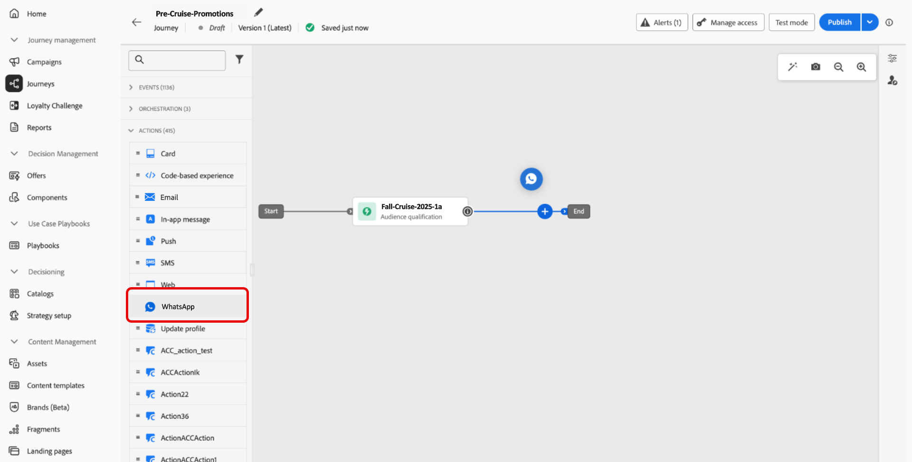

# Create a WhatsApp message {#create-whatsapp}

>[!BEGINSHADEBOX]

**Table of content**

* [Get started with WhatsApp messages](get-started-whatsapp.md)
* [Get started with WhatsApp configuration](whatsapp-configuration.md)
* **[Create a WhatsApp message](create-whatsapp.md)**
* [Check and send your WhatsApp messages](send-whatsapp.md)

>[!ENDSHADEBOX]

With Adobe Journey Optimizer, you can design and send engaging messages on WhatsApp. Simply add a WhatsApp action to your journey or campaign and craft your message content as detailed below. Adobe Journey Optimizer also lets you test your WhatsApp messages before sending them, ensuring perfect rendering, accurate personalization, and proper configuration of all settings.

>[!VIDEO](https://video.tv.adobe.com/v/3451621?learn=on)

## Add a WhatsApp message {#create-whatsapp-journey-campaign}

Browse the tabs below to learn how to add a WhatsApp message in a campaign or a journey.

>[!BEGINTABS]

>[!TAB Add a WhatsApp message to a Journey]

1. Open your journey then drag and drop a **WhatsApp activity** from the **Actions** section of the palette.

    

1. Provide basic information on your message (label, description, category), then choose the message configuration to use.

    For more information on how to configure a journey, refer to [this page](../building-journeys/journey-gs.md)

    The **[!UICONTROL configuration]** field is pre-filled, by default, with the last configuration used for that channel by the user.

You can now start designing the content of your WhatsApp message from the **[!UICONTROL Edit content]** button, as detailed below.

>[!TAB Add a WhatsApp message to a Campaign]

1. Access the **[!UICONTROL Campaigns]** menu, then click **[!UICONTROL Create campaign]**.

1. Select the **Scheduled - Marketing** campaign type.

1. From the **[!UICONTROL Properties]** section, edit your Campaign's **[!UICONTROL Title]** and **[!UICONTROL Description]**.

1. Click the **[!UICONTROL Select audience]** button to define the audience to target from the list of available Adobe Experience Platform audiences. [Learn more](../audience/about-audiences.md).

1. In the **[!UICONTROL Identity namespace]** field, choose the namespace to use in order to identify the individuals from the selected audience. [Learn more](../event/about-creating.md#select-the-namespace).

1. In the **[!UICONTROL Actions]** section, choose **[!UICONTROL WhatsApp]** and select or create a new configuration.

    Learn more about WhatsApp configuration in [this page](whatsapp-configuration.md).

1. Click **[!UICONTROL Create experiment]** to start configuring your content experiment and create treatments to measure their performance and identify the best option for your target audience. [Learn more](../content-management/content-experiment.md)

1. In the **[!UICONTROL Actions tracking]** section, specify if you want to track clicks on links in your WhatsApp message.

1. Campaigns are designed to be executed on a specific date or on a recurring frequency. Learn how to configure the **[!UICONTROL Schedule]** of your campaign in [this section](../campaigns/create-campaign.md#schedule). 

1. From the **[!UICONTROL Action triggers]** menu, choose the **[!UICONTROL Frequency]** of your SMS message:

    * Once
    * Daily
    * Weekly
    * Month
    
You can now start designing the content of your WhatsApp message from the **[!UICONTROL Edit content]** button, as detailed below.

>[!ENDTABS]

## Define your WhatsApp content{#whatsapp-content}

>[!IMPORTANT]
>
>Before designing your WhatsApp message in Journey Optimizer, you first need to create your template in Meta. [Learn more](https://www.facebook.com/business/help/2055875911147364?id=2129163877102343)

1. From the journey or campaign configuration screen, click the **[!UICONTROL Edit content]** button to configure the WhatsApp message content.

<!--
1. Select **[!UICONTROL Template message]**.
-->

1. Choose your **Template category**:

    * Marketing
    * Utility
    * Authentication

    [Learn more on Template categories](https://developers.facebook.com/docs/whatsapp/updates-to-pricing/new-template-guidelines/#template-category-guidelines)

1. From the **WhatsApp template** drop-down, select your previously created template designed in Meta. 

    [Learn more on how to create your Whatsapp templates](https://www.facebook.com/business/help/2055875911147364?id=2129163877102343)

1. Use the personalization editor to add personalization to your template. You can use any attribute, such as the profile name or city for example. 

    Browse through the following page to learn more about [personalization](../personalization/personalize.md).

1. Use the **[!UICONTROL Simulate content]** button to preview your WhatsApp message content, shortened URLs, and personalized content. [Learn more](send-whatsapp.md)

Once you have performed your tests and validated the content, you can send your WhatsApp message to your audience. These steps are detailed in [this page](send-whatsapp.md)

<!--
* **[!UICONTROL Template message]**: Predefined message imported from Meta into Journey Optimizer. These are intended for sending notifications, alerts, or updates to your customers.

* **[!UICONTROL Response message]**: Message created in Journey Optimizer and sent in reply to customer queries or interactions.

>[!BEGINTABS]

>[!TAB Template message]

1. From the journey or campaign configuration screen, click the **[!UICONTROL Edit content]** button to configure the WhatsApp message content.

1. Select **[!UICONTROL Template message]**.

1. Choose your Template category. [Learn more](https://developers.facebook.com/docs/WhatsApp/updates-to-pricing/new-template-guidelines/)

1. From the **WhatsApp template** drop-down, select your previously created template designed in Meta.

1. Use the personalization editor to define content, add personalization and dynamic content. You can use any attribute, such as the profile name or city for example. You can also define conditional rules. Browse to the following pages to learn more about [personalization](../personalization/personalize.md) and [dynamic content](../personalization/get-started-dynamic-content.md) in the personalization editor.

1. Use the **[!UICONTROL Simulate content]** button to preview your WhatsApp message content, shortened URLs, and personalized content. [Learn more](send-whatsapp.md)

Once you have performed your tests and validated the content, you can send your WhatsApp message to your audience. These steps are detailed in [this page](send-whatsapp.md)

>[!TAB Response message]

1. From the journey or campaign configuration screen, click the **[!UICONTROL Edit content]** button to configure the WhatsApp message content.

1. Select **[!UICONTROL Response message]**.

1. Enter your text in the **[!UICONTROL Body]** field.

1. Use the personalization editor to define content, add personalization and dynamic content. You can use any attribute, such as the profile name or city for example. You can also define conditional rules. Browse to the following pages to learn more about [personalization](../personalization/personalize.md) and [dynamic content](../personalization/get-started-dynamic-content.md) in the personalization editor.

1. Use the **[!UICONTROL Simulate content]** button to preview your WhatsApp message content, shortened URLs, and personalized content. [Learn more](send-whatsapp.md)

Once you have performed your tests and validated the content, you can send your WhatsApp message to your audience. These steps are detailed in [this page](send-whatsapp.md)

>[!ENDTABS]
-->
