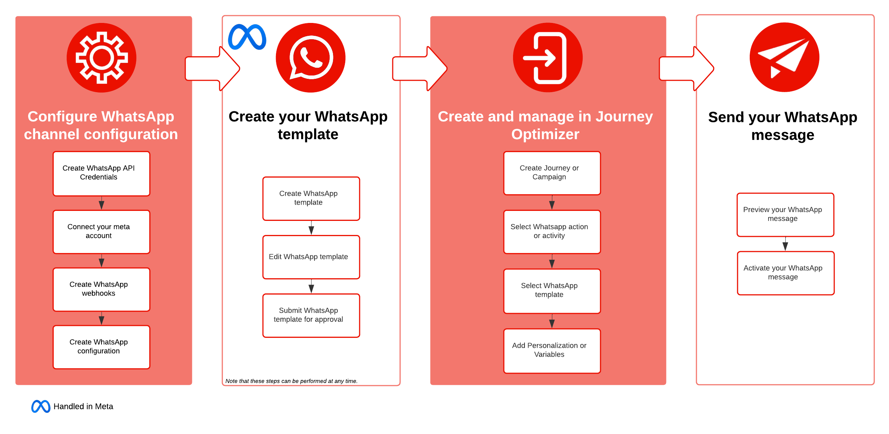

# Get started with WhatsApp messages {#get-started-whatsapp}

>[!BEGINSHADEBOX]

**Table of content**

* **[Get started with WhatsApp messages](get-started-whatsapp.md)**
* [Get started with WhatsApp configuration](whatsapp-configuration.md)
* [Create a WhatsApp message](create-whatsapp.md)
* [Check and send your WhatsApp messages](send-whatsapp.md)

>[!ENDSHADEBOX]

You can now send WhatsApp messages directly through Journey Optimizer via Meta's [Cloud API](https://developers.facebook.com/docs/whatsapp/cloud-api/). This feature enables seamless integration of WhatsApp into journeys and campaigns, enhancing communication and engagement with recipients.

* In a **Journey**. Create a journey, add a **WhatsApp** activity, and define basic settings, then browse to the **[!UICONTROL Actions: WhatsApp]** right pane to create the content for the WhatsApp message. Learn how to create a journey on [this page](../building-journeys/journey-gs.md).

* In a **Campaign**. Create a campaign, select **WhatsApp** as your action and define basic settings, then edit the message content to define the WhatsApp message to send. Learn how to create a campaign on [this page](../campaigns/create-campaign.md#configure).

{zoomable="yes"}

## Pre-requisites {#prereq}

Integrating WhatsApp with Journey Optimizer requires the following:

* Meta Business Manager account
* WhatsApp Business account
* WhatsApp phone number
* [User authorization token with appropriate permissions](https://developers.facebook.com/blog/post/2022/12/05/auth-tokens/) 
* [Approved Meta templates](https://developers.facebook.com/docs/whatsapp/message-templates/guidelines/)
* [Configuration of Meta Webhooks](https://developers.facebook.com/docs/whatsapp/webhooks/)

You also need to aknowledge the following before proceeding with integration:

* [WhatsApp content rules](https://www.whatsapp.com/legal/messaging-guidelines)
* [Compliance with Meta Policies](https://www.whatsapp.com/legal)
* [24 Hour conversation limits](https://developers.facebook.com/docs/whatsapp/messaging-limits/)

## Limitations {#limitations}

The following limitations apply to the WhatsApp channel:

* The WhatsApp channel in Adobe Journey Optimizer is HIPAA-ready, but third-party vendors are not covered under Adobe's BAA. Customers are responsible for their own compliance and vendor validation.

* Note that automated or predefined response messages are not be supported.

* Starting April 2025, delivery of all marketing template messages to WhatsApp users who have a United States phone number (a number composed of a +1 dialing code and a US area code) has been temporally suspended. [Learn more in Meta documentation](https://developers.facebook.com/docs/whatsapp/cloud-api/guides/send-message-templates#per-user-marketing-template-message-limits)

* The native integration functionality does not allow integration with third-party Business Service Provider (BSP).

## How-to video {#video}

The video below shows how to create a journey with a WhatsApp action.

+++ See video

>[!VIDEO](https://video.tv.adobe.com/v/3451621?learn=on)

+++
