# Get started with WhatsApp configuration {#whatsapp-config}

>[!BEGINSHADEBOX]

**On this page:** Set up WhatsApp API credentials, webhooks, and a channel configuration to connect your WhatsApp Business account, so your environment is ready to send WhatsApp messages with Journey Optimizer.

>[!ENDSHADEBOX]

Before sending your WhatsApp message, you must configure your Adobe Journey Optimizer environment and associate with your WhatsApp account. To perform this:

1. [Create your WhatsApp API credentials](#WhatsApp-credentials)
1. [Create your WhatsApp Webhooks](#WhatsApp-webhook)
1. [Create your WhatsApp configuration](#WhatsApp-configuration)

These steps must be performed by an Adobe Journey Optimizer [System Administrator](../start/path/administrator.md).

## Create WhatsApp API credentials {#whatsapp-credentials}

>[!CONTEXTUALHELP]
>id="ajo_admin_whatsapp_config_name"
>title="Name"
>abstract="Enter a unique name for this API credential set. You will select it when you configure WhatsApp webhooks and channel configurations."

>[!CONTEXTUALHELP]
>id="ajo_admin_whatsapp_config_api_token"
>title="API Token"
>abstract="Use a Meta access token from a System User in the same Business Manager as your WhatsApp assets. This user needs whatsapp_business_management, whatsapp_business_messaging, and business_management permissions, plus asset-level access to your WhatsApp Business Account. Meta tokens expire after about 60 days, renew the token before it lapses."

>[!CONTEXTUALHELP]
>id="ajo_admin_whatsapp_config_business_account_id"
>title="Business Account ID"
>abstract="Enter your Meta Business portfolio ID, also called the Business Manager ID. Do not enter your WhatsApp Business Account ID in this field."

1. In the left rail, browse to **[!UICONTROL Administration]** `>` **[!UICONTROL Channels]** and select the **[!UICONTROL API Credentials]** menu. Click the **[!UICONTROL Create new API credentials]** button.

1. Configure your API credentials, as detailed below:

    * **API Token**: Enter your API token. Learn more in [Meta Documentation](https://developers.facebook.com/blog/post/2022/12/05/auth-tokens/)
    * **Business Account ID**: Enter the unique number related to your business portfolio. Learn more in [Meta Documentation](https://www.facebook.com/business/help/1181250022022158?id=180505742745347).

    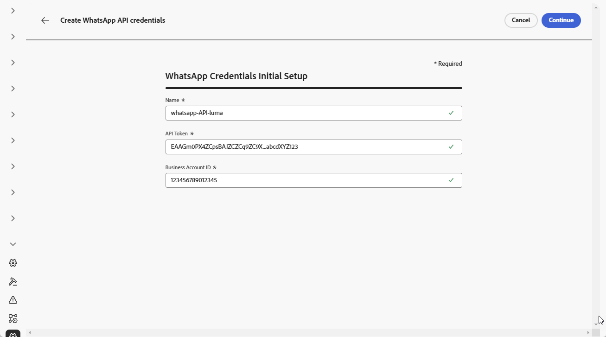

1. Click **[!UICONTROL Continue]**.

1. Choose the **WhatsApp Business Account** you want to connect to your WhatsApp API credentials.

    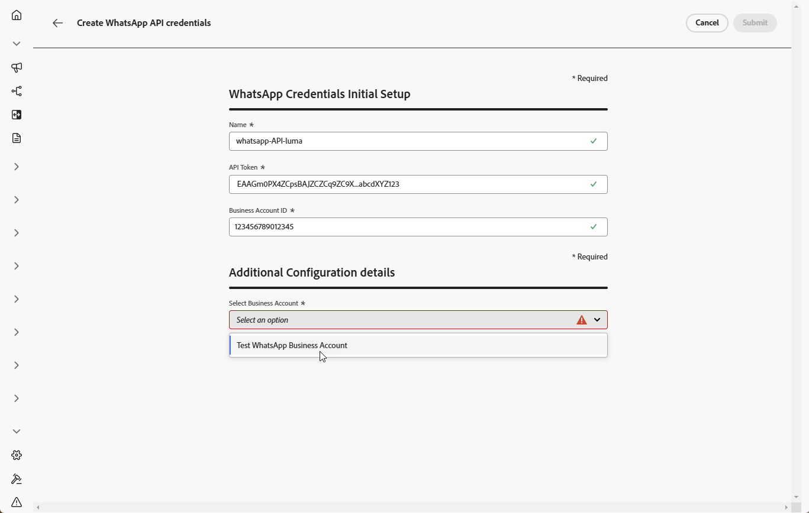

1. Select the **Sender name** used to send your WhatsApp messages.

1. Your phone number settings is automatically filled:

    * **Quality Rating**: reflects customer feedback on messages sent in the past 24 hours.
        * Green: High quality
        * Yellow: Medium quality
        * Red: Low quality
        
        Learn more about [Quality rating](https://www.facebook.com/business/help/766346674749731#)

    * **Throughput**: indicates the rate at which your phone number can send messages.

1. Click **[!UICONTROL Submit]** when you finished the configuration of your API credentials.

After creating and configuring your API credential, you now need to create your Webhook for WhatsApp messages. [Learn more](#whatsapp-webhook)

## Create Webhook {#WhatsApp-webhook}

>[!CONTEXTUALHELP]
>id="ajo_admin_whatsapp_webhook_inbound_keyword_category"
>title="Inbound keyword category"
>abstract="<b>Opt-In</b>: sends your defined auto-response when a user subscribes.  <b>Opt-Out</b>: sends your defined auto-response when a user unsubscribes.  <b>Help</b>:  sends your defined auto-response when a user requests help or support.  <b>Default</b>: sends your fallback auto-response when no keywords match.."

>[!CONTEXTUALHELP]
>id="ajo_admin_whatsapp_webhook_inbound_keyword"
>title="Enter your keywords"
>abstract="You can define keywords to trigger specific auto-responses based on what users text. Keywords are not case-sensitive, e.g., stop and STOP are treated the same."

>[!CONTEXTUALHELP]
>id="ajo_admin_whatsapp_webhook_webhook_url"
>title="Callback URL"
>abstract="The validation request and webhook notifications for this object are sent to the specified URL."

>[!CONTEXTUALHELP]
>id="ajo_admin_whatsapp_webhook_verify_token"
>title="Verify Token"
>abstract="The token that Meta echoes back to confirm and verify the callback URL during the verification process."

>[!NOTE]
>
>Without specified opt-in or opt-out keywords, standard consent messages are not enabled.

Once your WhatsApp API credentials have been successfully created, you can now configure Webhooks to:

* **Capture inbound responses** for managing opt-in and opt-out consent
* **Receive delivery reports** such as read receipts (where available) and message delivery status
* **Enable tracking events** for analytics and reporting in Adobe Experience Platform datasets

>[!NOTE]
>
>Inbound WhatsApp messages are captured in the _AJO Email Tracking Dataset_ system dataset. A profile must have at least one message sent from [!DNL Journey Optimizer] before incoming messages are captured in this dataset. [Learn more](../data/get-started-datasets.md#system-datasets)

Webhooks act as the communication bridge between Meta's WhatsApp Business Platform and Adobe Journey Optimizer, allowing you to receive real-time notifications about message events and user interactions.

Note that Meta allows only one webhook, callback URL and Verify Token, per WhatsApp Business Account, even across multiple sandboxes or WhatsApp credentials. **Feedback events** (Sent, Delivered, Read, Error, button click) are still captured correctly in every sandbox. **Inbound events** (replies, opt-in/opt-out/help keywords) are only received in the single sandbox where the webhook is registered, register it against your **production sandbox** to receive inbound events there.

1. In the left rail, navigate to **[!UICONTROL Administration]** `>` **[!UICONTROL Channels]**, select the **[!UICONTROL WhatsApp Webhooks]** menu under **[!UICONTROL WhatsApp settings]**, and click the **[!UICONTROL Create Webhook]** button.

    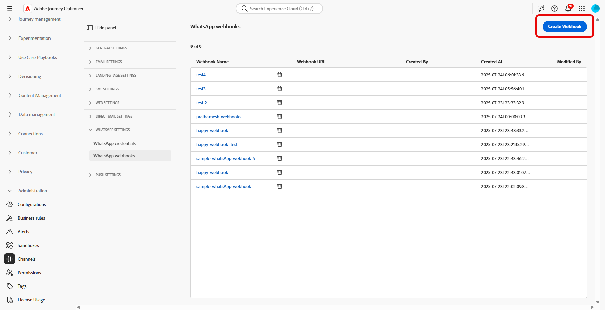

1. Enter a **[!UICONTROL Name]** for your webhook.

1. From the **[!UICONTROL Select configuration]** drop-down, select the [API Credentials](#whatsapp-credentials) you previously created.

    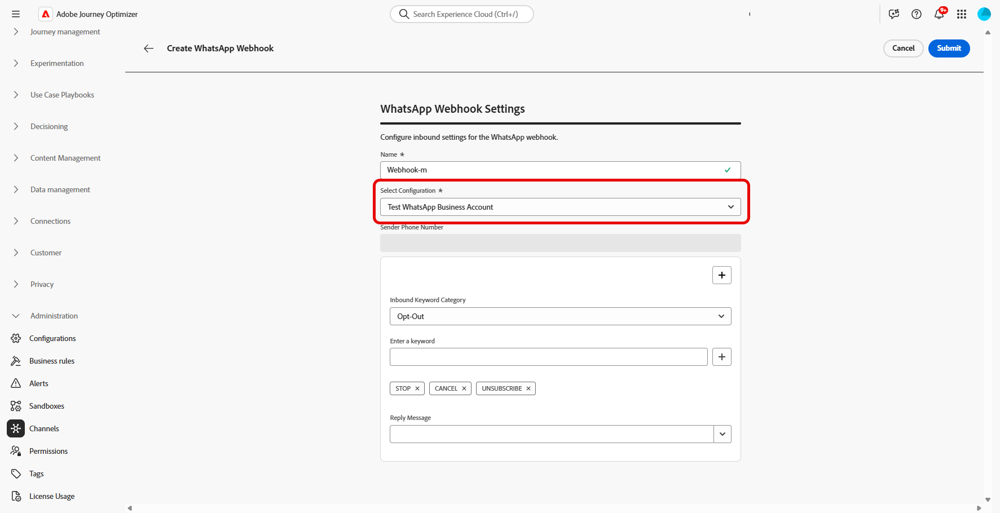

1. Choose your **[!UICONTROL Inbound keyword category]** such as:

    * **[!UICONTROL Opt-in Keywords]**
    * **[!UICONTROL Opt-out Keywords]**
    * **[!UICONTROL Help Keywords]**
    * **[!UICONTROL Default]** - Fallback category for all inbound messages that do not match other keywords. Use this category to enable tracking events (opens, delivery reports) in Adobe Experience Platform datasets.

1. Enter your **[!UICONTROL Keywords]** and click .

    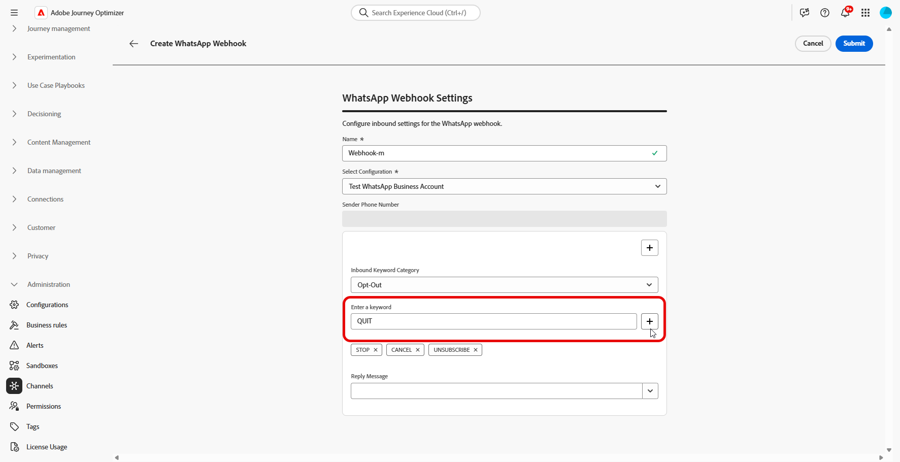

1. From the **[!UICONTROL Reply Message]** field, enter the message sent when a configured keyword is received, or select a pre-defined option from the drop-down menu.

    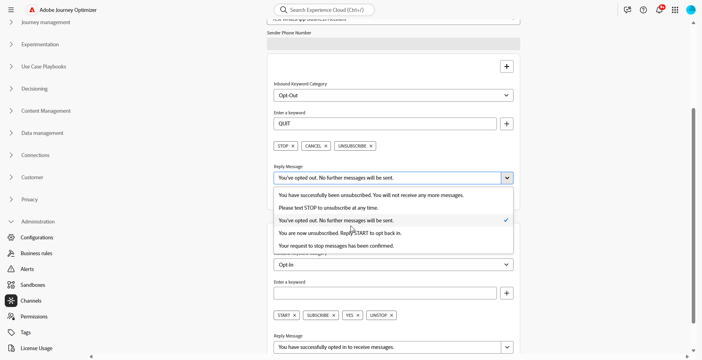

<!--
1. Click **[!UICONTROL View payload editor]** to validate and customize your request payloads. 
    
    You can dynamically personalize your payload using profile attributes, and ensure accurate data is sent for processing and response generation with the help of built-in helper functions.
-->
1. Click  to add additional **[!UICONTROL Inbound keyword]**.

1. Click **[!UICONTROL Submit]** when you finished the configuration of your WhatsApp Webhook.

1. In the **[!UICONTROL Webhooks]** menu, click the  to delete your WhatsApp Webhook.

    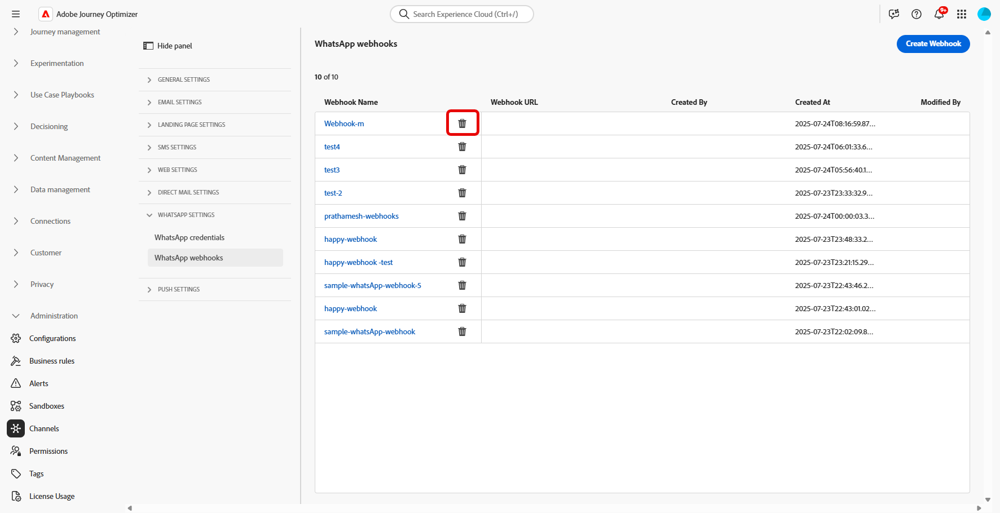

1. To modify existing configuration and access your **[!UICONTROL Webhook URL]** or **[!UICONTROL Webhook Verify toker]**, locate the desired Webhook and click the **[!UICONTROL Edit]** option to make the necessary changes.

1. Copy your **[!UICONTROL Webhook Verify toker]** generated here, then paste it into the Meta interface as part of your Webhook setup. 

    For detailed instructions on how and where to add this verification token, refer to [Meta documentation](https://developers.facebook.com/docs/graph-api/webhooks/getting-started#configure-webhooks-product).

1. Access and copy your new **[!UICONTROL Webhook URL]** from your previously submitted **[!UICONTROL WhatsApp Webhook]**.

    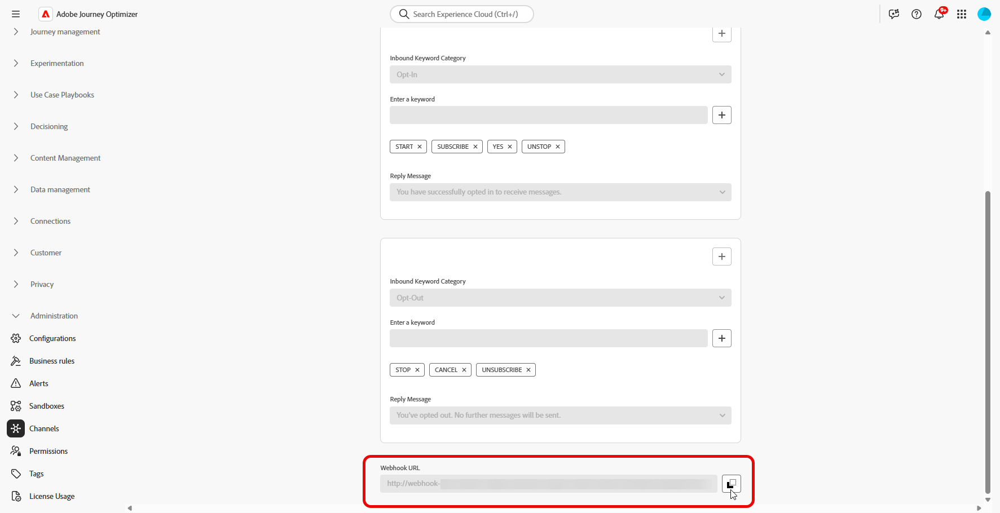

Now that your Webhook is configured, you can create your WhatsApp configuration.

## Create WhatsApp configuration {#whatsapp-configuration}

1. In the left rail, browse to **[!UICONTROL Administration]** > **[!UICONTROL Channels]** and select **[!UICONTROL General settings]** > **[!UICONTROL Channel configurations]**. Click the **[!UICONTROL Create channel configuration]** button.

    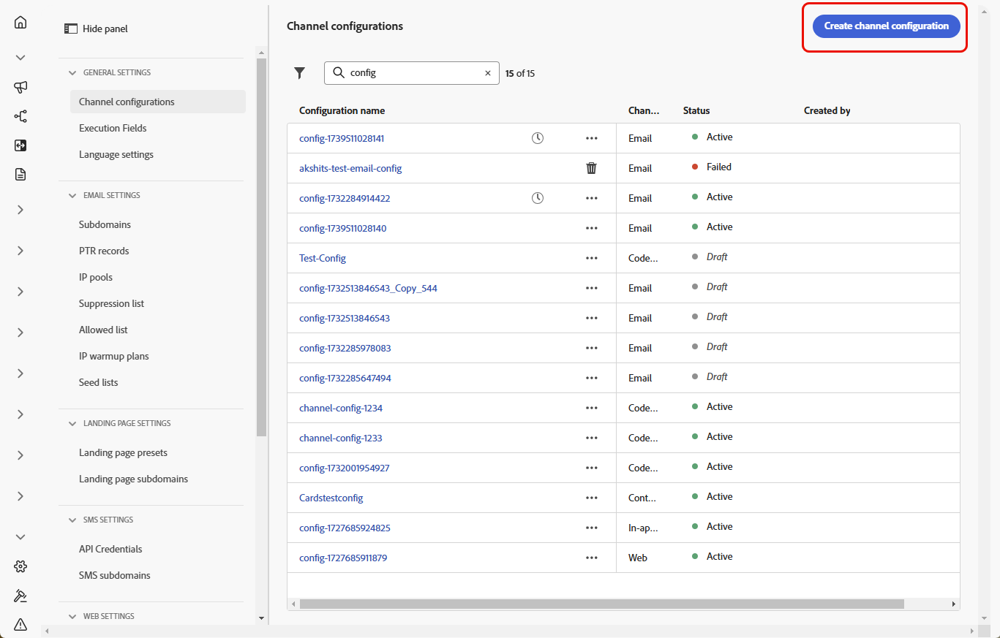

1. Enter a name and a description (optional) for the configuration, then select the WhatsApp channel.

    >[!NOTE]
    >
    > Names must begin with a letter (A-Z). It can only contain alpha-numeric characters. You can also use underscore `_`, dot`.` and hyphen `-` characters.

1. Select **[!DNL WhatsApp]** as your channel.

    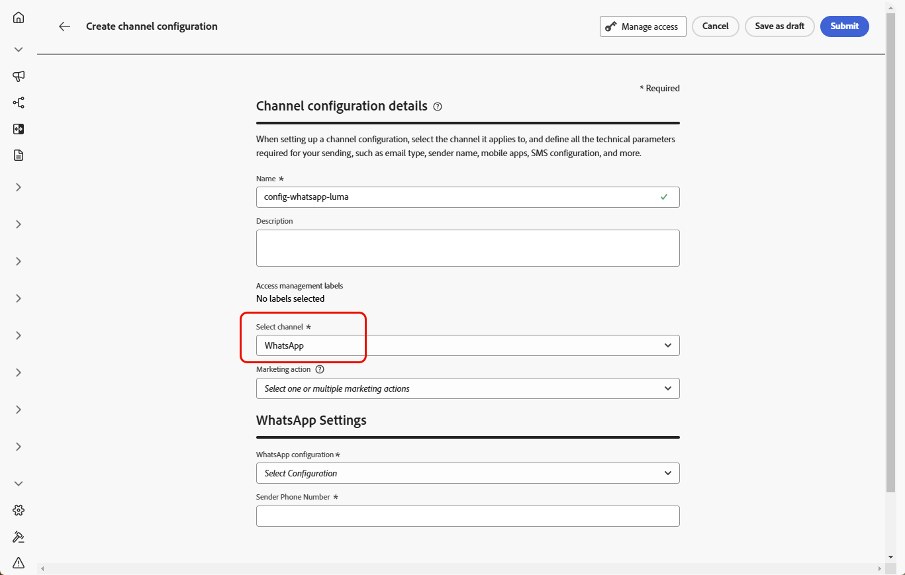{width=80%}

1. Select **[!UICONTROL Marketing action(s)]** to associate consent policies to the messages using this configuration. All consent policies associated with the marketing action are leveraged in order to respect the preferences of your customers. [Learn more](../action/consent.md#surface-marketing-actions)

1. In the **[!UICONTROL WhatsApp Settings]** section, select the previously created **[!UICONTROL WhatsApp configuration]**.

    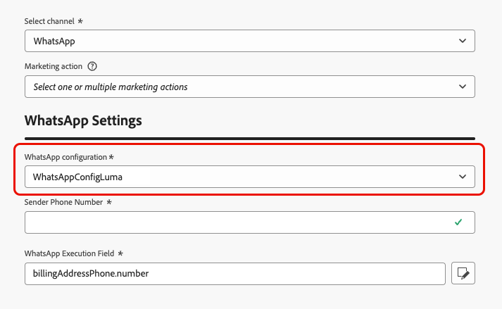{width=80%}

1. Enter the **[!UICONTROL Sender Phone Number]** ​you want to use for your communications. Do not include a '+' sign before the number, as this can prevent the opt-out flow from working correctly.

1. Use the **[!UICONTROL WhatsApp Execution Field]** to select amongst the profile attributes the phone number that you want to use in priority if several numbers are available in the database. [Learn more](../configuration/primary-email-addresses.md#override-execution-address-channel-config)

    >[!NOTE]
    >
    >By default, [!DNL Journey Optimizer] uses the phone number specified in the [general settings](../configuration/primary-email-addresses.md) at the sandbox level. Updating this field overrides the default value for the journeys and campaigns using this configuration.

1. Once all the parameters have been configured, click **[!UICONTROL Submit]** to confirm. You can also save the channel configuration as draft and resume its configuration later on.

1. Once the channel configuration has been created, it displays in the list with the **[!UICONTROL Processing]** status.

    >[!NOTE]
    >
    >If the checks are not successful, learn more on the possible failure reasons in [this section](../configuration/channel-surfaces.md).  

1. Once the checks are successful, the channel configuration gets the **[!UICONTROL Active]** status. It is ready to be used to deliver messages.

Once configured, you can leverage all out-of-the-box channel capabilities such as message authoring, personalization, link tracking, and reporting.

You are now ready to send WhatsApp messages with Journey Optimizer.

## Troubleshoot WhatsApp channel setup {#troubleshooting}

### HTTP 500 errors during API credential setup

If you encounter an HTTP 500 error when configuring WhatsApp API credentials, follow these troubleshooting steps:

1. **Verify entitlements**: Confirm that your organization has the `cjm_whatsapp` entitlement provisioned. Without this entitlement, the WhatsApp channel cannot be configured.

1. **Validate business account fields**: Ensure all mandatory fields are correctly filled:
    * **API Token**: Must be a valid Meta access token with appropriate permissions. [Learn more](https://developers.facebook.com/blog/post/2022/12/05/auth-tokens/)
    * **Business Account ID**: Must match your Meta Business Account ID exactly. [Learn more](https://www.facebook.com/business/help/1181250022022158?id=180505742745347)

1. **Test credentials externally**: Verify your credentials directly with the Meta API to confirm whether the issue is with the credentials or with Journey Optimizer credential handling.

1. **Enable advanced logging**: To identify internal server or authentication misconfigurations, enable advanced logs in your Journey Optimizer environment to provide detailed information about the API call failures.

1. **Contact support**: If the environment and entitlements are confirmed valid but the HTTP 500 error persists, contact your Adobe representative.

## How-to video {#video}

The video below shows how to set up the WhatsApp channel in Adobe Journey Optimizer.

+++ See video

>[!VIDEO](https://video.tv.adobe.com/v/3470268/?learn=on)

+++

{{$include /help/_includes/do-not-localize/whatsapp/ai-augmented-whatsapp-configuration.md}}
